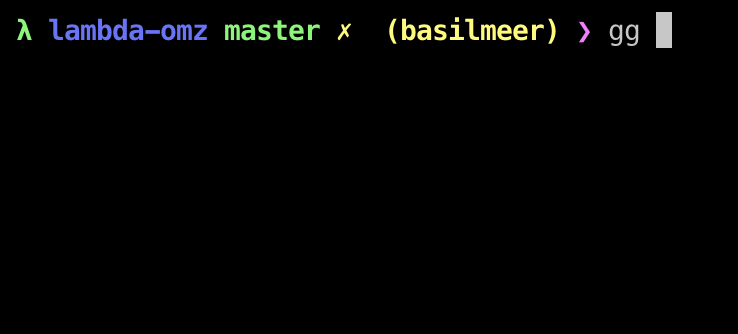

# Lambda

A Frankensteined [oh-my-zsh](https://ohmyz.sh) theme for [zsh](https://www.zsh.org/) that shows a plain prompt along with the committer name. Created due to a midnight stroke of inspiration.

I am aware the formatting is off. Will be fixed later.

## How to use

1. Copy `lambda.zsh-theme` into `~/.oh-my-zsh/custom/themes`
2. Set `ZSH_THEME="lambda"` in `~/.zshrc`

## Inspiration
[pi](https://github.com/tobyjamesthomas/pi)
